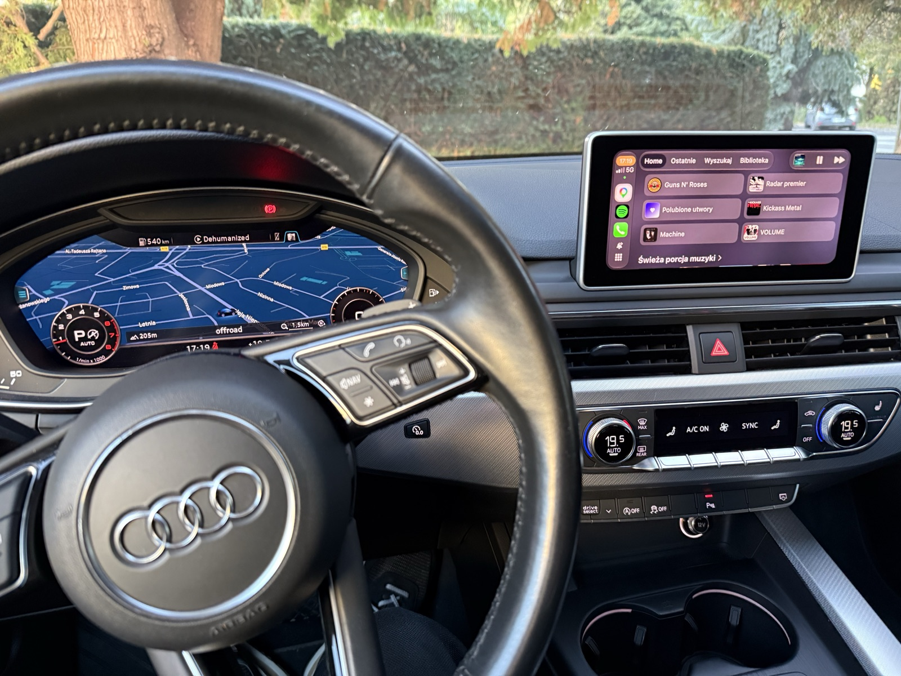

# mib2q-carplay

CarPlay on the Audi Virtual Cockpit for **MHI2Q** head units: turn-by-turn
guidance on the cluster and HUD, cover art, and, as an experimental option, the
CarPlay map video itself on the cluster (AltScreen).



> [!WARNING]
> This modifies firmware processes and system configuration on your head unit.
> Use it only on a unit you own, back up every file you change, and accept that
> you do it at your own risk.

## Contents

- [Features](#features)
- [Requirements](#requirements)
- [Build](#build)
- [Install](#install)
- [Logs and diagnostics](#logs-and-diagnostics)
- [Tests](#tests)
- [Repository layout](#repository-layout)
- [TODO](#todo)
- [Credits](#credits)
- [License](#license)

## Features

The base install needs no settings. Plug in the iPhone and the cluster features follow
CarPlay automatically.

- **Turn-by-turn on the cluster.** A 3D maneuver arrow is drawn over the stock cluster
  map, with lane arrows, distance to the turn, arrival time and remaining distance.
  This needs a navigation app that sends CarPlay route guidance: Apple Maps and Google
  Maps do, but Waze does not.
- **Route text in the Virtual Cockpit.** Shows the next road or exit sign. Press **OK**
  on the steering wheel to toggle arrival time and time left.
- **Head-up display.** The same maneuver icons, lanes and distance.
- **Cover art** on the cluster media screen.
- **Parking popups no longer hide CarPlay** (front PDC view).
- **MMI touchpad → D-pad** so drags navigate CarPlay menus.
- **AltScreen (optional, experimental).** The CarPlay map video on the cluster.
  Status and open issues are in
  [`docs/deploy/altscreen-mhi2q.md`](docs/deploy/altscreen-mhi2q.md).

**Compatibility:** Audi MHI2Q units with a fully digital cluster (Virtual Cockpit).
Developed and tested on an **Audi A5 (F5) with MU1329** firmware. Other MHI2Q
firmware and cluster layouts are untested; the Java patch is always built against
your own unit's HMI (see [Build](#build)), but cluster geometry may need calibration.

## Requirements

**On the build machine:**

| What | Why |
| --- | --- |
| Docker with `linux/amd64` support (Docker Desktop on macOS/Windows) | every artifact cross-compiles in a container; no host QNX SDP or JDK is needed to build |
| The `qnx65-armv7-toolchain` image (step 1) | GCC 8.5 for QNX 6.5 ARMv7, used by the native builds |
| Network access on the first build | the image fetches GCC/binutils sources; the AltScreen renderer fetches FFmpeg 6.1.5; `eclipse-temurin:8` is pulled for Java |
| Your unit's `lsd.jxe`, converted to a jar (step 2) | the Java patch compiles against the stock HMI classes |
| ~3 GB disk | toolchain image, Java image, `stock/` |

On Windows, run everything from **WSL** in a Linux path (`~/…`), not `/mnt/c`, and
not from Git Bash.

**On the car:** an MHI2Q unit with M.I.B. (More Incredible Bash) on an SD card, or a
root shell over SSH/Telnet.

## Build

### 1. Toolchain image (once)

```sh
git clone https://github.com/luka-dev/qnx65-armv7-toolchain
cd qnx65-armv7-toolchain
git config core.symlinks    # must not print "false"
docker build --platform=linux/amd64 --target base-env --build-arg BASE=base-8.5 \
    -t qnx65-armv7-toolchain:latest .
```

The image's QNX SDP contains about 150 symlinks. A checkout where they became plain
text files (`core.symlinks=false`, a Windows clone, a zip or a copied folder) fails
late, in `ar`, while linking libgcc. Clone it fresh if that happens. The first build
takes 30–60 minutes, longer on Apple Silicon under emulation.

### 2. Stock HMI jar → `stock/`

The Java patch compiles against your firmware's own classes (`de.audi.*`,
`de.esolutions.*`, `org.dsi.*`). These cannot be downloaded, so take them from your car:

1. Copy `lsd.jxe` off the unit into `stock/jxe/`. Either run
   `mods/extract_lsd_MoreIncredibleBash/` from M.I.B. (it only reads), or use SSH:
   ```sh
   scp root@<unit>:/mnt/app/eso/hmi/lsd/lsd.jxe stock/jxe/
   ```
2. Convert it with [jxe2jar](https://github.com/luka-dev/jxe2jar). The tool lives
   outside this repo and is not needed again afterwards:
   ```sh
   python3 src/jxe2jar.py /path/to/stock/jxe/lsd.jxe /path/to/stock/base.jar
   ```
3. Put the two public OSGi jars in `stock/libs/` (`org.osgi.framework-1.10.0.jar`,
   `org.osgi.util.tracker-1.5.4.jar`, both on Maven Central).

`stock/` is gitignored because it holds proprietary firmware code. The full layout,
including the optional test JDK, is in [`stock/README.md`](stock/README.md).

### 3. Build everything and stage the SD card

From the repository root:

```sh
./scripts/build_all.sh               # base + AltScreen
ALTSCREEN=0 ./scripts/build_all.sh   # base only
```

This runs every build below in order, then replaces
`mods/install_MoreIncredibleBash/mod/carplay/` with exactly one complete release. Copy
`mods/install_MoreIncredibleBash/` to the SD card and go to [Install](#install).

The individual builds write to `build/`:

```sh
./scripts/build_hook.sh                 # → build/libcarplay_hook.so
./scripts/build_renderers.sh            # → build/maneuver_render
./scripts/build_java.sh                 # → build/carplay_hook.jar
# optional: AltScreen (CarPlay map video on the cluster)
bash scripts/build_altscreen_render.sh  # → build/altscreen_render
./scripts/build_altscreen_hook.sh       # → build/libaltscreen111_mhi2q.so
```

| Artifact | Runs as | Needed for |
| --- | --- | --- |
| `libcarplay_hook.so` | `LD_PRELOAD` in `dio_manager` | everything (route guidance, cover art) |
| `maneuver_render` | cluster overlay process | maneuver arrow on the cluster |
| `carplay_hook.jar` | on the HMI's J9 boot classpath | cluster/HUD/BAP bridge, PDC, touchpad |
| `altscreen_render` | cluster video process | AltScreen only |
| `libaltscreen111_mhi2q.so` | second `LD_PRELOAD` in `dio_manager` | AltScreen only |

Optional switches:

- `LOG_RGD_PACKET_RAW=1 ./scripts/build_hook.sh` adds raw route-guidance packet dumps.
- `STOCK_JAR=<path inside stock/> ./scripts/build_java.sh` builds against a different
  jar.

To stage by hand instead, copy the five `build/` outputs, plus
`maneuver_render/resources/flag_atlas.rgba` and the four `carplay_*.sh` and
`carplay_child.json` from `deploy/smartphone_integrator/`, into
`mods/install_MoreIncredibleBash/mod/carplay/`. The installer stops before writing
anything if one of the eight base files is missing. The AltScreen pair and
`carplay_child.json` are picked up when present.

## Install

**With M.I.B. (recommended):**

1. Copy `mods/install_MoreIncredibleBash/` to the M.I.B. SD card.
2. Disconnect CarPlay.
3. Run **GEM → M.I.B. → Advanced Settings → Run Custom Script**.

The installer:
- copies the release into `/mnt/app/root/hooks/` and `/mnt/app/eso/hmi/lsd/jars/`;
- patches `smartphone_integrator.json` and `dio_manager.json` in place, keeping a
  `.carplay-stock` backup of each;
- never reboots or stops processes.

`mods/uninstall_MoreIncredibleBash/` reverts everything.

**Reboot:** disconnect CarPlay, run `sync`, wait a few seconds, then reboot normally.
Don't use the forced MMI button combo right after copying, because it can leave files
truncated. The jar only loads after a full restart.

The manual SSH install, the exact config edits and the verification steps are in
[`docs/deploy/install.md`](docs/deploy/install.md).

### M.I.B. helper scripts

| Folder | Effect |
| --- | --- |
| `mods/install_MoreIncredibleBash/` | install a staged release |
| `mods/uninstall_MoreIncredibleBash/` | remove it and restore the stock configs |
| `mods/logging_MoreIncredibleBash/` | save all logs to `<card>/carplay_logs/NNN/`, then turn on verbose logging |
| `mods/extract_lsd_MoreIncredibleBash/` | copy `lsd.jxe` to the card (read-only on the unit) |
| `mods/menu_install_MoreIncredibleBash/` | add the **CarPlay-RGI** page to the Green Engineering Menu (every action below as a button) |
| `rgd_enable_…` / `rgd_disable_…` | turn route guidance on/off at runtime |
| `altscreen_on_…` / `altscreen_off_…` | turn the AltScreen advertisement on/off (applies on the next phone connect) |
| `altscreen_grid_…` | toggle the calibration grid over the cluster video |
| `altscreen_safearea_…` | apply a custom AltScreen SafeArea from the card |

## Logs and diagnostics

Everything logs to `/tmp` on the unit. Logs are cleared on reboot, so collect them
before restarting.

| File | Source |
| --- | --- |
| `/tmp/carplay_hook.log` | native hook in `dio_manager` |
| `/tmp/carplay_java.log` | Java patch |
| `/tmp/maneuver_render.log` | maneuver renderer |
| `/tmp/carplay_wrapper.log` | startup wrapper and supervisor |
| `/tmp/altscreen111.log`, `/tmp/altscreen_render.log` | AltScreen hook and renderer |

By default only warnings and errors are logged. `touch /mnt/app/carplay_verbose`
enables full logging from the next phone connect. Without a shell, run
`mods/logging_MoreIncredibleBash/` twice instead: once to enable verbose logging, then
again after a CarPlay drive to collect.

## Tests

These run on the host and need no unit:

```sh
./scripts/run_tests.sh                 # C + shell: parser, bus, cover art, installer, supervisor
bash scripts/test_route_info.sh        # Java route guidance / BAP bridge against the stock jar
bash scripts/test_java_transports.sh   # Java bus, renderer sockets, touchpad, PDC
bash scripts/test_maneuver_native.sh   # renderer engine (ASan/UBSan)
```

The Java suites need `stock/base.jar` and a host JDK 8 in `stock/jdk/` (or set `JDK=`).

## Repository layout

| Path | Contents |
| --- | --- |
| `hook/` | `libcarplay_hook.so`: route guidance (iAP2 → BAP), cover art, runtime Identify patch |
| `java_patch/`, `java_resources/` | Java patch for the HMI and its packed resources |
| `maneuver_render/`, `common/` | GLES maneuver renderer and shared QNX Screen/GL code |
| `altscreen_hook/` | AltScreen hook: `/info` advertisement, stream-111 receiver, decrypt, local tee |
| `altscreen_render/` | AltScreen renderer: H.264 decode → GLES → cluster displayable 99 |
| `deploy/smartphone_integrator/` | on-unit startup/supervisor scripts and the SI child config |
| `mods/*_MoreIncredibleBash/` | M.I.B. custom scripts (see above) |
| `scripts/` | build entry points and test runners |
| `tests/` | host tests (C, Java, Python) |
| `toolchain/qnx65-abi/` | QNX Screen headers for cross-compilation |
| `docs/` | knowledge base; start at [`docs/INDEX.md`](docs/INDEX.md) |
| `stock/` | not in Git: your `lsd.jxe`, `base.jar`, libs, test JDK |
| `build/` | build outputs (not in Git) |

## TODO

- [ ] **Wireless CarPlay dongles need more investigation.** The tested dongle
  (`smartBox-xxxx`, a generic adapter sold under many brands) gives standard CarPlay on
  the main screen but no map on the Virtual Cockpit. What we found:
  - it always identifies itself as an iPhone 7 on iOS 14.4 (`model=iPhone9,1`,
    `osBuildVersion=18D70`, `sourceVersion=535.3`), whichever phone is behind it;
  - it never requests the cluster stream (type 111), even when the AltScreen display is
    advertised, and with the advertisement it failed to connect or dropped within
    seconds, so the hook now sends this sender the stock `/info`;
  - it does not answer CarPlay route-guidance requests, so the turn-by-turn arrow does
    not work through it either.

  A dongle that forwards the cluster stream would work without changes on the car side:
  `SETUP … types=111` in `/tmp/altscreen111.log` shows it. Open points: test other
  adapters (reports mention OTTOCAST U2-AIR and AAWireless TWO+), check firmware updates,
  and look at custom firmware for Carlinkit-class hardware
  ([ludwig-v/wireless-carplay-dongle-reverse-engineering](https://github.com/ludwig-v/wireless-carplay-dongle-reverse-engineering)).
- [ ] **Android Auto support** on the Virtual Cockpit (map and turn-by-turn).

## Credits

> [!IMPORTANT]
> **The biggest thanks go to
> [Mr-MIBonk/M.I.B._More-Incredible-Bash](https://github.com/Mr-MIBonk/M.I.B._More-Incredible-Bash)**,
> the base this mod is built on. M.I.B. is what makes it possible to run custom scripts
> on the head unit from an SD card at all: every install, update, uninstall and log
> collection here runs through its **Run Custom Script**, and its Green Engineering Menu
> integration is where the CarPlay-RGI menu lives. Without M.I.B. none of this would reach
> the car.

This repository combines and builds on the work of others:

- **[luka-dev/mib2q-carplay-rgi](https://github.com/luka-dev/mib2q-carplay-rgi)** by
  LuKa (@LuKa_dev) is the base of this project: the hook, Java patch, maneuver
  renderer, installer and most of the knowledge base.
- **[harman-f/mhi2_altscreen_carplay](https://github.com/harman-f/mhi2_altscreen_carplay)**
  provides the GEN2 AltScreen hook (`altscreen_hook/`), originally for Škoda MU1440.
- **[luka-dev/qnx65-armv7-toolchain](https://github.com/luka-dev/qnx65-armv7-toolchain)**:
  the QNX 6.5 cross-toolchain image.
- **[luka-dev/jxe2jar](https://github.com/luka-dev/jxe2jar)**: JXE → JAR conversion
  of the stock HMI.
- **[stb_image](https://github.com/nothings/stb)** by Sean Barrett, used for cover-art
  decoding (public domain / MIT).
- **[FFmpeg](https://ffmpeg.org)**: a minimal static H.264 decoder in
  `altscreen_render` (LGPL-2.1-or-later).

Thanks also for prior research to
[ludwig-v/wireless-carplay-dongle-reverse-engineering](https://github.com/ludwig-v/wireless-carplay-dongle-reverse-engineering),
[adi961/mib2-android-auto-vc](https://github.com/adi961/mib2-android-auto-vc),
[OneB1t/VcMOSTRenderMqb](https://github.com/OneB1t/VcMOSTRenderMqb),
[EthanArbuckle/iPhone18-3_26.1_23B85_Restore](https://github.com/EthanArbuckle/iPhone18-3_26.1_23B85_Restore),
[@fifthBro](https://t.me/fifthBro) and the M.I.B. / MIB2 community.

## License

[GNU General Public License v3.0 or later](LICENSE) for the work in this repository,
including the AltScreen hook, which is GPL-3.0 upstream.

Files marked `Copyright (c) LuKa (@LuKa_dev)` come from `luka-dev/mib2q-carplay-rgi`,
which was published **without a license**. They remain their author's under whatever
terms the author sets. Third-party components keep their own licenses (stb_image:
public domain/MIT; FFmpeg: LGPL-2.1-or-later).

No firmware, stock HMI classes or Apple components are distributed here. `stock/`
stays on your machine.
