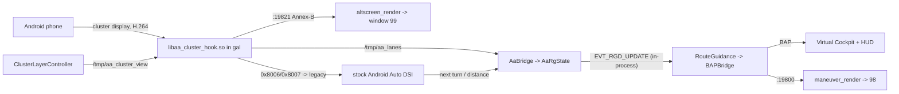

# Android Auto - cluster guidance and cluster map

Android Auto support reuses the CarPlay stack: the same route-guidance chain, BAP writer,
maneuver renderer, cluster contexts and video renderer. It is adapted from
[wasimlhr/mib2q-android-auto-cluster](https://github.com/wasimlhr/mib2q-android-auto-cluster),
an Android-Auto-only fork of LuKa's project validated on MU0918. That fork replaces the
CarPlay features. Here, both phone types work on one install, and the session owner decides
which features run.

Tested on an Audi A5 (F5) with MU1329 (`MHI2Q_ER_AUG22_P5152`): everything below works there
except a zoom for the Android Auto cluster map, which Android Auto does not offer. The unit's
`libautoreceiver.so` is byte-identical to the MU0918 one; its `gal` has its own profile
([firmware-porting](firmware-porting.md)).

## 📋 What you get

| Feature | Needs | MU1329 |
|---|---|---|
| Turn arrow, distance bar, lanes and route text in the Virtual Cockpit and HUD | jar only | works |
| Maneuver arrow over the Audi map / over the phone map | jar + `maneuver_render` | works |
| Android Auto cover art on the VC media screen | jar only | works |
| Google Maps / Waze **map video** in the cockpit (ctx 81/82) | + `aa_startup.sh`, `libaa_cluster_hook.so`, `altscreen_render` | works (receiver profile built in) |
| Large / Classic / Sport layouts sent to the phone | + the hook | works |
| Steering-wheel roller zoom of the phone map | - | not possible: no zoom command for the cluster display; the roller zooms only the hidden Audi map (scale bar) |

Without the hook, or with it switched off, Android Auto is stock on the centre screen and the
first three rows still work. Those Java features come from the stock Android Auto DSI, not the
cluster display.

## 🗂️ Process topology

```text
smartphone_integrator            (boot-resident; spawns gal on Android phone connect)
  +- aa_startup.sh                children.gal; exec's into gal (same PID)
      = gal                       stock receiver + LD_PRELOAD libaa_cluster_hook.so
      |   +- tee 127.0.0.1:19821  Annex-B H.264 of the cluster display
      +- carplay_monitor.sh       owner /tmp/aa_supervisor.owner (same script as CarPlay)
          +- maneuver_render      TCP 127.0.0.1:19800 (Java -> renderer)
          +- altscreen_render     reads :19820 (CarPlay) or :19821 (Android Auto) -> window 99

Java patch (lsd.jxe, alive from boot)
  +- AndroidAuto2ListenerDistributor -> AaBridge (DSI events, device state)
  +- CarPlayApp modules (owner = Android Auto): Screen, AltScreen, Rgd
```

## 🧭 Data flow



## 🧩 Pieces

**Java** (`carplay_hook.jar`)
- `AndroidAuto2ListenerDistributor`, `nav/AndroidAuto2NavHandler`: stock classes rebuilt with
  one hook each. The P5152 originals were decompiled and match the reviewed MU0918 versions
  member for member and body for body. The build's member check confirms no stock member was lost.
- `aa/AaBridge`: device state -> `CarPlayApp.onActivateAndroidAuto` / `onDeactivateAndroidAuto`.
  It subscribes the next-turn attributes and hands `AaRgState` frames to `RouteGuidance`
  through `CarplayBus.injectLocal`, so BAPBridge stays the single BAP writer.
- `aa/AaRgState`, `aa/AaManeuverMap`, `aa/AaLaneFeed`: Android Auto turn events -> the same
  text frame the CarPlay C hook produces (one maneuver slot, generation per route, lanes).
- `aa/VcMapViewGate` + `ClusterService.updateGALState`: while ctx 81/82 shows the phone's
  map, the stock "navigation on mobile device" state (BAP InfoStates 6) is held back. That
  state would take the VC out of its map view.
- `aa/AaClusterView`: the cockpit view (full / classic / sport) for the hook's layouts.
- `aa/AaCoverArt` + `aa/PngCover`: `gal` saves the album art to `/tmp/gal_albumArt_<n>.png` and
  reports it (DSI coverArtUrl), which stock ignores. The file is normalised to a 256x256 RGB
  PNG (the fork's car-tested J9 decoder/encoder), written to `/var/app/icab/tmp/37/` beside the
  CarPlay cover, and handed to `CoverArt`, whose CarPlay merge then runs for Android Auto too.
- `CarPlayApp`: one session owner. `isActive()` still means "CarPlay session", so the CarPlay-only
  callers (PDC guard, CarPlay cover art) are unchanged. `SteeringWheelInputModule` runs for
  CarPlay only. `RgdModule` takes over route guidance per phone route for Android Auto
  instead of for the whole session, so Audi navigation keeps working with an Android phone connected.

**Native**
- `aa_hook/` (`libaa_cluster_hook.so`, preloaded into `gal` only): registers a second H.264
  sink (1920x1080, margins 480x540 -> a centred 1440x540 viewport) and an input endpoint
  for display 1. It requests protocol 4.3 and tells the 2016 receiver 1.7, drops the receiver's
  "unexpected message" reply, translates the new navigation messages to the legacy pair, and
  sends the dark theme and the view's safe area (0x8009 on every view change). Frames go to a
  loopback tee that keeps the AUs since the last keyframe, so a renderer that connects late
  starts on a keyframe.
- `altscreen_render`: one renderer for both phone types. It tries the CarPlay tee, then the
  Android Auto tee. For Android Auto it opens the hardware decoder at 1920x1080 and blits the
  centred 1440x540 viewport 1:1 into window 99 (no scaling); the FFmpeg fallback crops the same
  rectangle. For Android Auto, liveness lasts for the whole tee connection after the first
  picture: the phone sends about one picture every 6 s while its map is still, and a timeout
  made the cockpit blink between the phone map and the Audi map (car log 020). A failed
  Android Auto hardware decode switches off only its own marker.
- `aa_startup.sh`: `children.gal` wrapper. It always ends in the stock `gal`, starts the shared
  monitor with the renderers' tested library path, and preloads the hook only if it is
  installed and `aa_cluster.off` is absent.

## 🔧 Switches

They apply on the next phone connection, except the first row, which needs a reboot.

| File | Effect |
|---|---|
| `/mnt/app/carplay_aa.disabled` (or `/tmp/...`) | Java bridge off: Android Auto completely stock (read when the HMI starts) |
| `/mnt/app/root/aa_cluster.off` | no cluster display (M.I.B./GEM: *Android Auto cluster map OFF*) |
| `/mnt/app/root/aa_cluster.abi_trial` | run the hook on a receiver without a profile (testing only; `gal` may crash) |
| `/mnt/app/root/aa_cluster.navxlate_off` / `.relayout_off` | leave new nav messages alone / no layout updates |
| `/mnt/app/root/aa_cluster.dpi` | density, one number 80..400 (default 125 = 1:1 on the 125 PPI panel) |
| `/mnt/app/root/aa_cluster.insets` | 12 numbers: top bottom left right for full, classic, sport |
| `/mnt/app/root/altscreen_render.aa.hwdecode.off` | Android Auto software decode |
| `/mnt/app/carplay_rgd.disabled` | route guidance off for both phone types |

## 📜 Logs

`/tmp/carplay_java.log` (tag `AA`), `/tmp/aa_cluster_hook.log`, `/tmp/aa_wrapper.log`,
`/tmp/altscreen_render.log`. The logging mod collects them, and once per card it also copies
`gal` and `libautoreceiver.so` to `carplay_logs/aa/` for [firmware-porting](firmware-porting.md).

## ⚠️ Known limits

- No zoom of the phone's cluster map: Android Auto has no zoom command for the cluster
  display and ignores rotary input there. (The fork's workaround, rescaling the safe area,
  only reframed the map and was removed.)
- Dark map only: the Light and Automatic themes on the cluster display crashed Android Auto
  on the phone (upstream on-car runs).
- Size and density apply on the next phone connection; layouts switch live.
- A route started while parked shows Google's "depart" step at 0 m until the car moves; it
  is shown as soon as Android Auto reports navigation focus (car log 021).
- Not ported from upstream: the cockpit options menu, touchpad input on the cluster display,
  the turn card and the 720p band mode.
