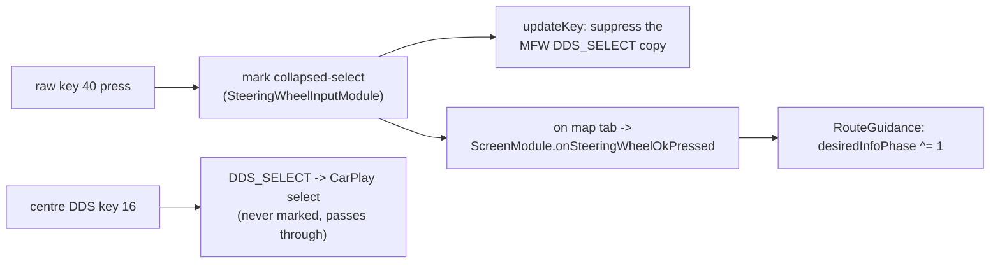

# Steering-wheel roller - zoom & route-info toggle

The left MFW roller has two axes: **rotation** and **press**. On this branch the cluster shows the
stock native map, so rotation is left to stock - except while the CarPlay cluster video is up,
when it zooms the CarPlay map instead (below). The press is repurposed.

## 📋 Context

> MFW roller -> **rotation** = stock native-map zoom (CarPlay map zoom while AltScreen video is up) - **press** = cluster route-info toggle ->
> [bap-fctids](../rgd/bap-fctids.md) FctID 19 -> [rgd-activation](../rgd/rgd-activation.md).

## 🔄 Rotation (zoom) -> stock map, or CarPlay while the cluster video is up

The roller sends rotation as Navigation-BAP `MapScale.steps` (`CombiBAPListener.setMapScale(int)`,
which stock applies as an increment of the kombi map's scale context).

- **Stock native map on the VC:** `ScreenCombiBAPListener.setMapScale` passes the step to stock
  unchanged, which zooms the native cluster map exactly as stock does.
- **CarPlay cluster video (AltScreen, plane 99) on the VC** (`ScreenModule.isConnected() &&
  isAltScreenActive()`): the step goes to the hook as `CMD_ALT_ZOOM` `[i8 steps]`, and stock gets
  `setMapScale(0)`, which only sends the BAP MapScale status the VC expects (the hidden stock map
  does not move). `hook/altzoom` hands the step to `altscreen111_map_zoom()` in the AltScreen hook,
  which queues it; its control worker sends one `changeMapZoomLevel {uuid, zoomDirection}`
  (0 = in, 1 = out) per step, at most one every 150 ms.

> [!WARNING]
> `changeMapZoomLevel` comes from the harman-f/mhi2_altscreen_carplay iOS command index and is not
> vehicle-proven yet. `/tmp/altscreen111.log` logs every step (`gen2 changeMapZoomLevel ...`) and the
> phone's answer (`gen2 DIAG completion command=changeMapZoomLevel status=...`; 0 = accepted).
> Default mapping: a positive MapScale step zooms **out**. If the roller zooms the wrong way,
> `touch /mnt/app/root/mibr-carplay111-zoom.inverted`. To test without the roller:
> `touch /tmp/mibr-alt111-zoom-in` or `/tmp/mibr-alt111-zoom-out`.

## ⚙️ Press (OK) -> route-info toggle

The raw MFW roller press (DSI key 40, `KEY_MFW_ROLLER_LEFT`) and the centre-console DDS (key 16,
`KEY_DDS`) both collapse to the same `DDS_SELECT` in the stock keyboard stack. `SteeringWheelInputModule`
observes the raw `ATTR_KEY2` stream and marks only key 40, so `CarplayDSILifecycleController.updateKey`
can **suppress that one copy** of `DDS_SELECT` before it reaches iOS (via `consumeCollapsedSelect`) -
the centre knob still selects in the CarPlay Main UI.

Gated to the confirmed VC map tab, the press then calls `ScreenModule.onSteeringWheelOkPressed()` ->
`RouteGuidance` toggles the cluster route-info line between the **next turn-to street** (phase 0) and
the **trip summary** (ETA / arrival clock + remaining, phase 1). Phase 1 falls back to phase 0 by
itself 20 s after it was published. Text layout: [vc-route-text](../rgd/vc-route-text.md) (FctID 19).

